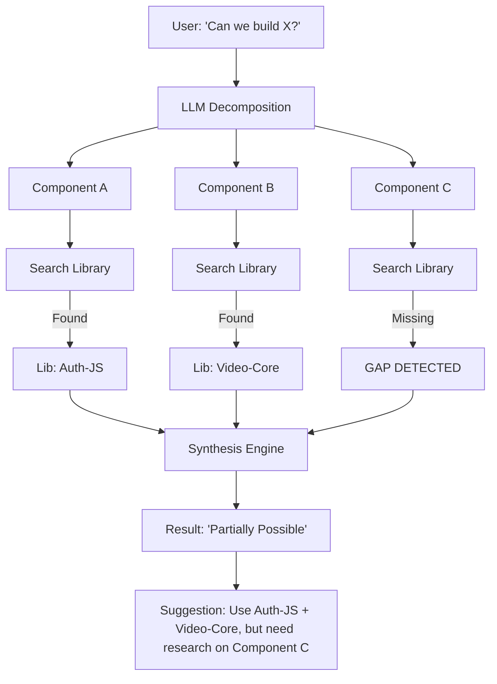

# Research: Open Source Library & Workflow Playground

**Date**: 2026-01-16
**Status**: DRAFT
**Context**: We need to create a research initiative for an open source library feature in Nostra. This will utilize Nostra spaces or the workflow engine to establish a standard for ingesting and analyzing open source repositories. The goal is to create a playground for scientists (AI or human) to match ideas with technologies and, as an inherent benefit, map these technologies to recognize gaps. This is explicitly NOT for managing Pull Requests or code issues.

## 1. Executive Summary
This initiative focuses on establishing a "Library" or "Playground" within Nostra dedicated to the high-level analysis and mapping of open source technologies. By leveraging the Workflow Engine, we aim to ingest repository metadata and code structures to create a knowledge graph that helps users (AI and human) connect ideas with existing implementations and identify innovation gaps.

## 2. Core Question(s)
- **Metric of "Fit"**: How do we mathematically score the "fit" between an abstract Idea and a concrete Library? Vector Similarity vs Function Signature Matching?
- **Verification**: How does the system verify that a library *actually* does what the README says? (Can we autogenerate test harnesses in the Playground?)
- **Evolution**: How does the library handle version updates? Does it re-analyze on every commit or just tags?

## 3. Findings & Analysis

### 3.1 Standardization of Ingestion (Delegated to 127)
To standardize ingestion into Nostra Spaces without creating a code-management tool, we must treat repositories as volatile runtime "Data Sources".
*   **Analysis**: Managing clones and file systems directly inside 015 violates the temporal boundary.
*   **Recommendation**:
    *   **Delegation**: Rely completely on **Initiative 127 (Cortex-Native Repo Ingestion)**. Under `127`, repositories are formally registered in `ingestion_registry.toml` and cloned securely into `cortex-memory-fs/sandbox/{repo-id}`.
    *   **Entity Mapping**: Map ingested repositories to the `Library` Entity type defined in [008-nostra-contribution-types](../008-nostra-contribution-types/PLAN.md).

### 3.2 Workflow Primitives for Analysis (Delegated to 126)
The Workflow Engine needs specific primitives to handle code-as-data.
*   **Analysis**: Standard text primitives are insufficient for code understanding.
*   **Recommendation**:
    *   **Agent Tasks**: Use `AgentTask` primitives executed by the **Cortex Agent Runtime Harness (126)**.
    *   `agent-task-ast-parse`: Extract classes, functions, and interfaces natively in Cortex.
    *   `agent-task-llm-summarize`: Generate a high-level capability summary of a directory.
    *   `Graph.MapEntity`: System operation to map a discovered capability to a known "Concept" node (e.g., "OAuth" -> "Authentication").

### 3.3 Visualization & Making Matchmaking
Visual relationships are key for the "Playground" feel.
*   **Analysis**: Lists are static. A Force-directed graph allows "Ideas" (Abstract) to float near "Technologies" (Concrete) based on semantic similarity.
*   **Recommendation**: Implement a **Semantic Knowledge Graph**.
    *   **Nodes**: `Idea` (ContributionType), `Proposal` / `Issue` (ContributionType for gaps), `Library` (EntityType), `Function` (EntityType).
    *   **Edges**: `Implements`, `Solves`, `Requires`.

### 3.4 Workflow: "Is this Functionally Possible Today?"
This is a flagship workflow for the Scientist's Playground.
*   **Concept**: A validation engine that checks if a hypothetical idea has existing technological building blocks.
*   **Workflow Steps**:
    1.  **Input**: User describes "Hypothetical Feature X".
    2.  **Decomposition**: LLM breaks X into functional components (A, B, C).
    3.  **Search**: Engine queries the Library for existing implementations of A, B, C.
    4.  **Synthesis**:
        *   *Perfect Match*: "Yes, use Library Y."
        *   *Partial*: "Possible, combine Lib Y and Z."
        *   *Gap*: "No, component B has no known implementation."

### 3.5 Gap Identification
*   **Analysis**: Gaps are simply "Ideas" with no strong edges to "Technologies."
*   **Recommendation**:
    *   **Gap Heatmaps**: Visualize areas in the graph with high "Idea" density but low "Code" density.
    *   **Automated Briefs**: When a gap is confirmed, the system auto-generates a "Research Brief" for a human developer to solve.

### 3.6 Scope Enforcement (No PRs/Issues)
*   **Analysis**: If it looks like GitHub, people will treat it like GitHub.
*   **Recommendation**:
    *   **Read-Only by Design**: The underlying file system access for the user is strictly strictly ephemeral/sandbox.
    *   **Divergent UI**: The interface should look like a laboratory (nodes, connections, data streams), not a file browser.
    *   **Snapshotting**: "Ingesting" creates a snapshot metadata record. It does not track git history refs for the purpose of merging.

## 4. Recommendations & Next Steps

> [!NOTE]
> See [PLAN.md](./PLAN.md) for the detailed implementation roadmap and [DECISIONS.md](./DECISIONS.md) for architectural choices.

1.  **Ingestion**: Proceed with Phase 1 (Ingestion Pipeline) as defined in the Plan.
2.  **Prototyping**: Begin "Laboratory" UI mocks (See Phase 3).
3.  **Research**: Address the "Metric of Fit" question in [FEEDBACK.md](./FEEDBACK.md).

