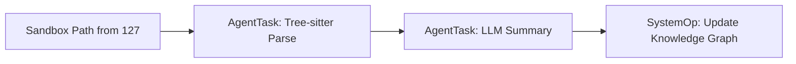
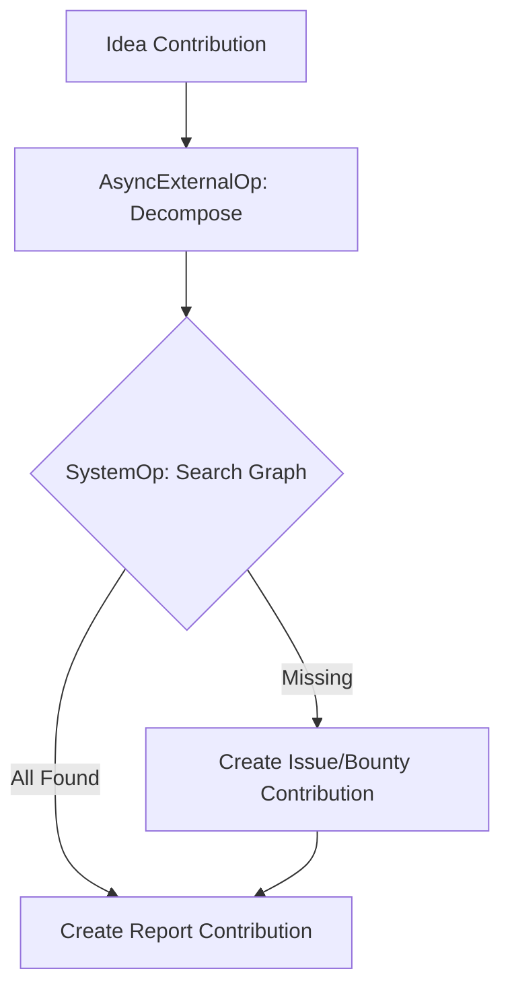

# Workflows

# Workflows

## 1. Knowledge Graph Generation Workflow (Post-Ingestion)

**Goal**: Transform a locally ingested repository sandbox (managed by `127-cortex-native-repo-ingestion`) into a structured Knowledge Graph node within the Nostra Library.

*Note: Raw cloning and git operations are explicitly delegated to `127`. This workflow assumes the repository already exists inside the `cortex-memory-fs/sandbox/` temporal boundary.*

### CNCF Serverless Workflow Definition

```yaml
id: generate-library-knowledge-graph
name: Generate Library Knowledge Graph
description: Parses an ingested repository sandbox to map capabilities to 008 Concepts.
start: ParseCodebase
states:
  - name: ParseCodebase
    type: operation
    actions:
      - name: ASTSymbolExtraction
        functionRef:
          refName: agent-task-ast-parse
          arguments:
            target_dir: "${ .sandbox_path }"
            tool: "tree-sitter"
    transition: SummarizeCapabilities

  - name: SummarizeCapabilities
    type: operation
    actions:
      - name: BuildSummary
        functionRef:
          refName: agent-task-llm-summarize
          arguments:
            symbols: "${ .ast_output }"
            readme: "${ .readme_content }"
    transition: MapToGraph

  - name: MapToGraph
    type: operation
    actions:
      - name: CreateNodesAndEdges
        functionRef:
          refName: nostra-graph-mutation
          arguments:
            library_node: "${ .repo_name }"
            concepts: "${ .capability_summary.concepts }"
            edge_type: "IMPLEMENTS"
    end: true
```

### Workflow Diagram


---

## 2. Feasibility Check ("Is this possible?") Workflow

**Goal**: Determine if a user's hypothetical idea can be built using existing library components. This functions as an Executable Service within Nostra.

### CNCF Serverless Workflow Definition

```yaml
id: feasibility-check-service
name: Feasibility Check Executable Service
description: Determines if a hypothetical Idea can be built using existing Library entities.
start: DecomposeIdea
states:
  - name: DecomposeIdea
    type: operation
    actions:
      - name: LLMDecomposition
        functionRef:
          refName: async-external-op-llm
          arguments:
            prompt: "Decompose this idea into core technical components: ${ .user_idea }"
    transition: SearchGraph

  - name: SearchGraph
    type: operation
    actions:
      - name: SearchLibraryNodes
        functionRef:
          refName: nostra-graph-query
          arguments:
            components: "${ .decomposition_result.components }"
            node_type: "EntityType: Library"
    transition: EvaluateGaps

  - name: EvaluateGaps
    type: switch
    dataConditions:
      - condition: "${ .search_results.unmatched_components == 0 }"
        transition: GenerateReport
      - condition: "${ .search_results.unmatched_components > 0 }"
        transition: ProposeBounty

  - name: ProposeBounty
    type: operation
    actions:
      - name: CreateGapIssue
        functionRef:
          refName: nostra-create-contribution
          arguments:
            type: "Issue"
            content: "Gap detected for components: ${ .search_results.unmatched_components }"
    transition: GenerateReport

  - name: GenerateReport
    type: operation
    actions:
      - name: CreateFeasibilityReport
        functionRef:
          refName: nostra-create-contribution
          arguments:
            type: "Report"
            content: "Feasibility Report for ${ .user_idea }. Matches: ${ .search_results.matched }. Gaps: ${ .search_results.unmatched_components }"
    end: true
```

### Workflow Diagram


## 3. Code Verification (Delegated to 126)

**Goal**: Verify code correctness.
*Note: This workflow is officially deferred to **Initiative 126 (Agent Harness)** which handles sandboxed deterministic execution using the Authority Guard.*

