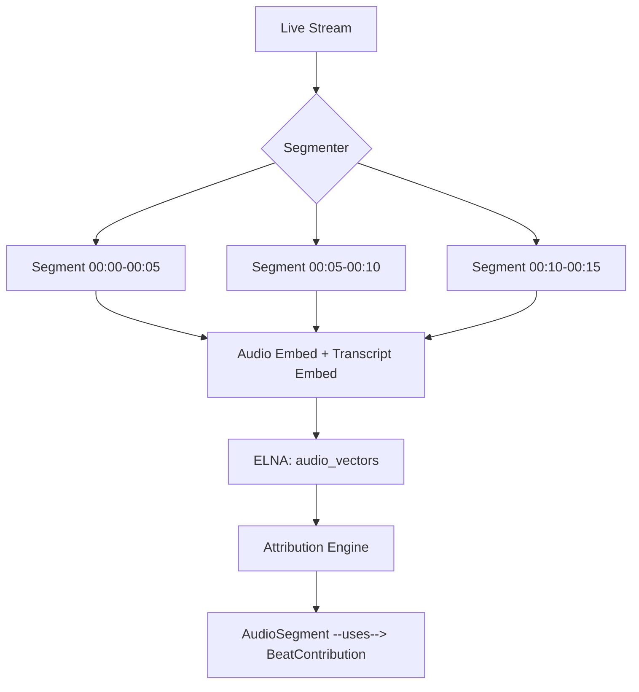

# Decisions: Vector Database & Embedding Model Strategy

This document logs key architectural and strategic decisions for the vector database and embedding model strategy.

---

## DEC-042-001: Primary Vector Database Selection

**Date**: 2026-01-20
**Status**: APPROVED
**Context**: Multiple on-chain vector database options exist on ICP (ELNA, Blueband, ArcMind, Kinic).

**Decision**:
> **ELNA-Vector-DB** is selected as the primary on-chain vector database for Nostra.

**Rationale**:
1. **Production Ready**: Open-source, Apache 2.0, actively maintained.
2. **Algorithm**: Uses HNSW (`instant-distance`) for fast ANN, outperforms brute-force alternatives.
3. **Access Control**: Built-in RBAC aligns with Nostra Space permissions.
4. **Local Availability**: Canonical path is `/Users/xaoj/ICP/research/reference/topics/data-knowledge/elna-vector-db` with compatibility symlink `/Users/xaoj/ICP/elna-vector-db`.
5. **Community**: Part of ELNA AI ecosystem with broader adoption on ICP.

**Alternatives Considered**:
- **Blueband**: Too simple (no HNSW), suitable only for prototypes.
- **ArcMind**: Promising for multi-modal, but earlier maturity.
- **Kinic**: Consumer-focused, less flexibility for custom integration.

**Implications**:
- `VectorService` in `nostra-worker` will target ELNA APIs.
- Future migration to ArcMind considered only if multi-modal is required.

---

## DEC-042-002: Standard Embedding Dimension

**Date**: 2026-01-20
**Status**: APPROVED
**Context**: Different embedding models produce different vector dimensions (384, 768, 1536), causing incompatibility.

**Decision**:
> The Nostra standard embedding dimension is **384**.

**Rationale**:
1. **Cost**: 384-dim vectors are 4x cheaper to store/query than 1536-dim.
2. **Performance**: Faster cosine similarity computation.
3. **Quality**: Modern 384-dim models (e.g., `all-MiniLM-L6-v2`) achieve ~95% of larger model quality.
4. **Compatibility**: Easier migration to on-chain models (smaller fits Ignition constraints).

**Alternatives Considered**:
- **768-dim** (BERT-base): Overkill for most use cases.
- **1536-dim** (OpenAI): Best quality, but expensive.

**Implications**:
- All embedding providers must output or quantize to 384 dimensions.
- Schema `nostra.vector` will enforce this standard.

---

## DEC-042-003: Architecture Path Selection

**Date**: 2026-01-20
**Status**: APPROVED
**Context**: Three architecture paths identified (Fully On-Chain, Hybrid, Multi-Canister Sharding).

**Decision**:
> Start with **Path A (Fully On-Chain)** for simplicity.
> Plan **Path B (Hybrid)** as fallback when scale exceeds 100K vectors.

**Rationale**:
1. **Current Scale**: Most Nostra use cases are < 100K vectors.
2. **Simplicity**: Fully on-chain avoids external infra dependencies.
3. **Decentralization**: Aligns with ICP ethos.
4. **Flexibility**: Hybrid path provides escape hatch for enterprise scale.

**Alternatives Considered**:
- **Start with Hybrid**: Over-engineered for current needs.
- **Multi-Canister Sharding**: Too complex, cross-canister latency concerns.

**Implications**:
- Phase 4 in PLAN.md prepares Hybrid architecture.
- Monitoring instrumented to alert at 80K vectors.

---

## DEC-042-004: Embedding Provider Abstraction

**Date**: 2026-01-20
**Status**: APPROVED
**Context**: Need to support multiple embedding generation methods (OpenAI, Local, ICP-Native).

**Decision**:
> Implement `EmbeddingProvider` trait with pluggable implementations.

**Design**:
```rust
pub trait EmbeddingProvider: Send + Sync {
    async fn embed(&self, text: &str) -> Result<Vec<f32>, EmbeddingError>;
    fn dimension(&self) -> usize;
    fn model_id(&self) -> String;
}
```

**Initial Implementations**:
1. `OpenAIEmbedder` – Uses `text-embedding-3-small` (quantized to 384).
2. `LocalEmbedder` – Uses `all-MiniLM-L6-v2` via ONNX runtime.
3. `IcpNativeEmbedder` – Future, pending Ignition eval.

**Rationale**:
1. **Flexibility**: Easy to swap providers without architectural changes.
2. **Testing**: Mock embedder for unit tests.
3. **Migration**: Seamless transition to on-chain when ready.

**Implications**:
- Configuration to select provider per Space or globally.
- Model ID stored with vectors for versioning.

---

## DEC-042-005: Logical Form-Guided Hybrid Reasoning

**Date**: 2026-01-20 (Updated: 2026-03-06)
**Status**: APPROVED
**Context**: Best practices recommend combining keyword and semantic search. KAG further demonstrates that Schema-Constrained Logical Forms outperform pure RAG and GraphRAG on multi-hop fact queries.

**Decision**:
> Implement **Logical Form-Guided Hybrid Reasoning**, stacking Reciprocal Rank Fusion (RRF) for vector+keyword alongside Graph Traversal and Schema-Constrained Query Planning.

**Algorithm**:
1. **Semantic & Keyword Retrieval**: `RRF_score(doc) = Σ (1 / (k + rank_i(doc)))` (where `k = 60`).
2. **Graph Expansion**: BFS traversal from top-ranked nodes.
3. **Logical Form Routing**: Complex queries are decomposed and routed through reasoning, retrieval, and computation operators.

**Rationale**:
1. **Surpasses Pure RAG**: Prevents semantic flattening by maintaining logical graph structures (Graphiti + OpenSPG patterns).
2. **Robustness**: RRF provides a strong, tunable baseline for unstructured similarity.
3. **Adaptability**: Supports explicit mathematical/factual deduction (KAG) instead of solely relying on LLM generative context.

**Alternatives Considered**:
- **Pure RRF (Previous standard)**: Insufficient for professional domain multi-hop logic without graph traversal.
- **Cross-Encoder Reranking**: Too compute-heavy for on-chain deployment.

**Implications**:
- Both keyword, semantic, and graph expansion results are merged.
- Cortex query router manages logical form generation, passing constraints down to the backend `VectorService`.

---

## DEC-042-006: Relationship with Initiative 041

**Date**: 2026-01-20
**Status**: APPROVED
**Context**: Initiative 041 already covers ELNA integration. Clarify relationship.

**Decision**:
> **042 is the Strategy Layer; 041 is the Implementation Layer**.

**Scope Delineation**:
| Aspect | 041 | 042 |
|:-------|:----|:----|
| ELNA deployment & VectorService | ✅ | ❌ |
| Embedding model selection | ❌ | ✅ |
| Hybrid search architecture | ❌ | ✅ |
| `nostra.vector` schema design | ❌ | ✅ |
| Scaling strategy | ❌ | ✅ |
| Day-to-day ops (insert/query) | ✅ | ❌ |

**Rationale**:
1. **Separation of Concerns**: Strategy vs. Implementation.
2. **Avoid Duplication**: 041 continues as-is; 042 provides guidance.

**Implications**:
- 042 PLAN.md references 041 PLAN.md phases.
- 040 (Schema Standards) owns `nostra.vector` definition, guided by 042.

---

## DEC-042-007: Cross-Space Semantic Search Policy

**Date**: 2026-01-20
**Status**: APPROVED
**Context**: User requested federated semantic search across Spaces with privacy considerations.

**Decision**:
> Enable cross-Space semantic search for **public Spaces** (opt-in) and **parent Spaces** (hierarchical inheritance).

**Rules**:
1. **Public Spaces**: Add `allow_cross_space_search: bool` to Space settings. Default: `false`.
2. **Private Spaces**: Search automatically includes vectors from parent Spaces (inherited access).
3. **Access Control**: Only vectors the user has read permission for are queried.
4. **Architecture**: Query router fans out to authorized Space canisters, aggregates results.

**Rationale**:
1. **User Request**: Explicit guidance to support cross-space search.
2. **Privacy-First**: Opt-in for public, inherited for private maintains user control.
3. **Scalability**: Federated design avoids centralized vector store.

**Implications**:
- Space settings schema must include `allow_cross_space_search` flag.
- Query router logic added to Cortex backend.
- Parent Space relationship must be traversable for private space inheritance.

---

## DEC-042-008: Embedding Model Upgrade Strategy

**Date**: 2026-01-20
**Status**: APPROVED
**Context**: Need strategy for migrating vectors when embedding model changes (e.g., `nostra-embed-v1` → `nostra-embed-v2`).

**Decision**:
> Use **Dual-Index + Gradual Migration** as the primary upgrade strategy.
> Use **Lazy Re-embedding** as a secondary strategy for cold data.

**Migration Process**:
1. Create new index namespace (`vectors_v2`).
2. Route new inserts to both `vectors_v1` and `vectors_v2`.
3. Background job re-embeds existing vectors to `vectors_v2`.
4. Track migration progress (% migrated).
5. At 95% completion, switch query routing to `vectors_v2` only.
6. Archive `vectors_v1` after 30-day validation period.

**Rationale**:
1. **Zero Downtime**: Users are never blocked during migration.
2. **Rollback**: Easy revert to `vectors_v1` if issues arise.
3. **A/B Testing**: Can compare search quality between versions.
4. **Industry Best Practice**: Recommended by Milvus, Pinecone, and other vector DB providers.

**Alternatives Considered**:
- **Big-Bang Re-embedding**: Too risky for production, causes downtime.
- **Version-Aware Search**: Score normalization is complex and degrades quality.

**Implications**:
- Storage doubles during migration period.
- Background re-embedding job must be cycle-efficient.
- `model_id` field required in vector metadata.

---

## DEC-042-009: ICP Native Embedding Strategy

**Date**: 2026-01-20
**Status**: APPROVED
**Context**: No public benchmarks exist for embedding models on ICP Ignition (as of 2026-01-20).

**Decision**:
> **Do not block on ICP native embeddings.**
> Continue off-chain approach (OpenAI/Local) as primary.
> Prototype on-chain embeddings in Q2-Q3 2026.

**Rationale**:
1. **No Benchmarks**: DFINITY has not published embedding model performance data.
2. **Off-Chain Works**: OpenAI API is proven, cost-effective (~$0.0001/1K tokens), low latency (~100ms).
3. **Ignition Focus**: Ignition milestone focused on LLM inference, not embeddings.
4. **Estimated Cost**: On-chain embedding likely 50-100M cycles (~$0.00005-0.0001), 1-5s latency.

**Action Plan**:
| Phase | Timeline | Action |
|:------|:---------|:-------|
| Short-Term | Now | Use off-chain embedding (OpenAI, Local) |
| Mid-Term | Q2-Q3 2026 | Prototype `all-MiniLM-L6-v2` ONNX on ICP |
| Long-Term | 2026+ | `IcpNativeEmbedder` if benchmarks are favorable |

**Implications**:
- `EmbeddingProvider` trait supports future `IcpNativeEmbedder`.
- Benchmark results to be documented in `benchmarks/` folder.
- Privacy-critical Spaces may prioritize on-chain embeddings when viable.

---

## DEC-042-010: Canonical Embedding Interface (CEI)

**Date**: 2026-01-21
**Status**: APPROVED
**Context**: Models are replaceable; embedding contracts are not. Need a stable schema for maintainability.

**Decision**:
> Define a **Canonical Embedding Interface (CEI)** schema that all embedding models must conform to.

**Schema** (Conceptual):
```rust
struct Embedding {
    id: EmbeddingId,
    contribution_id: ContributionId,      // Link to source Entity
    artifact_id: Option<ArtifactId>,       // Link to specific artifact (file, image)
    modality: Modality,                    // Text | Image | Audio | Video | Multimodal
    scope: Scope,                          // Global | Space | Local
    model_family: ModelFamily,             // Jina | MiniLM | OpenAI | Custom
    model_version: String,
    vector: Vec<f32>,
    created_at: Time,
    produced_by_agent: Option<AgentId>,    // For agent-aware embeddings
    confidence: Option<f32>,
}
```

**Rationale**:
1. **Model Swapping**: Enable provider changes without re-architecting.
2. **Parallel Embeddings**: Same artifact can have embeddings from different models.
3. **Progressive Upgrades**: Seamless transition to Jina v5 or future audio/video models.
4. **Auditability**: Agent-aware tagging enables trust-weighted reasoning.

**Implications**:
- Extends `nostra.vector` schema in 040.
- `EmbeddingProvider` trait (DEC-042-004) outputs to this schema.

---

## DEC-042-011: Modal-Aware Vector Storage

**Date**: 2026-01-21
**Status**: APPROVED
**Context**: Storing all embeddings in one undifferentiated table hinders performance and maintainability.

**Decision**:
> Store embeddings in **modality-specific indices** (canister namespaces or logical partitions).

**Storage Structure**:
| Store | Purpose |
|:------|:--------|
| `text_vectors` | Ideas, comments, reports, transcripts |
| `image_vectors` | Diagrams, screenshots, keyframes |
| `audio_vectors` | Voice, meetings (from Whisper transcripts) |
| `video_segments` | Time-scoped embeddings (keyframe + transcript) |
| `graph_vectors` | Structural similarity (future) |

**Rationale**:
1. **Faster Queries**: Scoped indices reduce search space.
2. **Cleaner Migrations**: Re-embed one modality without affecting others.
3. **Easier Pruning**: Delete old video embeddings independently.
4. **ICP Alignment**: Fits canister specialization model.

**Implications**:
- ELNA namespace conventions to be defined.
- Query router must fan out to relevant modal stores.

---

## DEC-042-012: Query-Adaptive Hybrid Similarity Scoring

**Date**: 2026-01-21 (Updated: 2026-03-06)
**Status**: APPROVED
**Context**: Embeddings alone can drift; graph relationships are stable. Fixed scoring weights fail to capture intent variance between exploratory, factual, and governance queries.

**Decision**:
> Similarity scores combine embedding, graph, and lineage signals, using **query-adaptive weights** driven by explicit retrieval mode selections.

**Formula**:
```
Similarity =
  α * EmbeddingSimilarity
+ β * GraphDistance
+ γ * TagOverlap
+ δ * SharedLineage
+ ε * LogicalFormScore (multi-hop bonus)
```

**Adaptive Weights**:
- **Exploratory Queries** (e.g., "Find related concepts"): High `α` (Semantic).
- **Factual/Resolution Queries** (e.g., "Who published X?"): High `β` (Graph) and `δ` (Lineage).
- **Governance Queries** (e.g., "Decisions about Y"): High `γ` (TagOverlap) due to formal artifact tagging.

**Rationale**:
1. **Embeddings Drift**: Model updates change semantic space.
2. **Graph Is Stable**: Entity relationships persist.
3. **Prevents Semantic Flattening**: Avoids "everything looks similar" problem.
4. **NOSTRA Differentiator**: This is how Nostra avoids becoming "just another vector DB."

**Implications**:
- Cortex query layer must integrate with Knowledge Graph (037).
- Similarity Canister API to expose this composite scoring.

---

## DEC-042-013: Agent-Aware Embeddings

**Date**: 2026-01-21
**Status**: APPROVED
**Context**: As agents generate embeddings autonomously, need to track provenance for trust.

**Decision**:
> Tag embeddings with agent provenance: `produced_by_agent`, `confidence`, `purpose`.

**Fields**:
| Field | Description |
|:------|:------------|
| `produced_by_agent` | AgentId of the agent that generated the embedding |
| `confidence` | 0.0-1.0 score (from agent's self-assessment) |
| `purpose` | Semantic tag (e.g., `retrieval`, `clustering`, `classification`) |

**Rationale**:
1. **Trust-Weighted Reasoning**: Low-confidence embeddings can be down-ranked.
2. **Agent Specialization**: Query agents can filter by producer.
3. **Conflict Detection**: Identify when agents disagree on semantic similarity.
4. **Auditability**: Trace AI-generated content back to source agent.

**Implications**:
- Part of CEI schema (DEC-042-010).
- Requires agent registry integration (012 Bootstrap Protocol).

---

## DEC-042-014: CEI Temporal Extension (Time-Scoped Embeddings)

**Date**: 2026-01-21
**Status**: APPROVED
**Context**: Audio and video are time-indexed contribution streams. Need temporal fields in CEI.

**Decision**:
> Extend the CEI schema (DEC-042-010) with **temporal fields** for time-scoped embeddings.

**Extended Schema** (Additions):
```rust
struct Embedding {
    // ... existing fields from DEC-042-010 ...

    // Temporal Extension
    timestamp_start: Option<Time>,         // Start of segment (e.g., 00:05)
    timestamp_end: Option<Time>,           // End of segment (e.g., 00:10)
    source_stream_id: Option<StreamId>,    // Link to parent live stream
    is_centroid: bool,                     // True if this is a summarizing centroid
}
```

**Rationale**:
1. **Live Streaming**: Enables "rolling window" embeddings for live audio/video.
2. **Attribution**: Time-scoped embeddings enable "This beat was playing when that vocal happened" queries.
3. **Archival**: Segment-level granularity allows pruning old segments while keeping centroids.
4. **047 Alignment**: Matches Temporal's "Event-Driven" and "Durable Execution" patterns.

**Implications**:
- `video_segments` store (DEC-042-011) uses these fields.
- Query API supports `timestamp_range` filters.

---

## DEC-042-015: Temporal Audio Contributions (Segmented Streams)

**Date**: 2026-01-21
**Status**: APPROVED
**Context**: Audio is not an artifact; audio is a **time-indexed contribution stream**. This is the foundational reframe for live streaming and attribution.

**Decision**:
> Treat live audio/video as **segmented contributions**, not monolithic files.

**Architecture**:


**Segment Structure**:
| Field | Description |
|:------|:------------|
| `timestamp_start` | Start of segment (e.g., 00:00) |
| `timestamp_end` | End of segment (e.g., 00:05) |
| `audio_embedding` | From wav2vec/Whisper |
| `transcript_embedding` | From Jina v4 (text) |
| `spectral_fingerprint` | For beat/sample matching |
| `attribution_edges` | Links to known beats, stems, contributions |

**Use Cases**:
-   **Live Attribution Overlays**: "Beat by X", "Sample from Y".
-   **Real-Time Credit Accrual**: Attribution is a temporal join, not an ID lookup.
-   **Post-Hoc Royalty Computation**: Query by time range + similarity.
-   **DSVR Alignment**: Media streaming + live credit vision.

**Rolling Window Strategy**:
1.  Embed every N seconds (e.g., 5-10s).
2.  Periodically compute **Segment Centroid** and **Stream Centroid**.
3.  Discard raw segment embeddings after TTL; keep centroids for long-term memory.

**Rationale**:
1. **Predictable Cost**: Fixed embedding rate regardless of stream length.
2. **Low Latency**: Real-time attribution without waiting for stream end.
3. **Historical Traceability**: Centroids preserve semantic memory.
4. **Governance**: Versioned, model-identified, time-scoped embeddings enable auditable disputes.

**Implications**:
- Extends `audio_vectors` store (DEC-042-011) with segment structure.
- Requires `Segmenter` service in `nostra-worker`.
- Aligns with 047 Temporal Architecture patterns ("Durable Execution", "Event-Driven").

---

## DEC-042-016: Time-Aware Semantic Ledger (Strategic Vision)

**Date**: 2026-01-21
**Status**: APPROVED
**Context**: NOSTRA is quietly becoming a time-aware semantic ledger. Embeddings are not just for search.

**Decision**:
> Recognize embeddings as **evidence, memory, attribution, and coordination infrastructure**, not just a search feature.

**Strategic Roles of Embeddings**:
| Role | Example |
|:-----|:--------|
| **Evidence** | "This segment matches that beat" → Attribution proof. |
| **Memory** | Centroids preserve semantic understanding over time. |
| **Attribution** | Time-scoped similarity enables live credit. |
| **Coordination** | Agents use embeddings to discover related work. |

**Implications**:
-   This is the **"why"** behind the embedding strategy.
-   All embedding decisions (CEI, Modal-Aware, Hybrid Scoring, Agent-Aware, Temporal) serve this vision.
-   Embeddings are infrastructure, not a feature.


---

## DEC-042-017: Embedding Lineage & Re-Embedding Policy

**Date**: 2026-02-05
**Status**: APPROVED
**Context**: Embeddings must remain auditable across model changes, content revisions, and perspective shifts.

**Decision**:
> Extend embedding metadata to include `source_version_id`, `model_id`, and `perspective_scope`, and define a re-embedding policy triggered by model, content, or perspective changes.

**Implications**:
- Metadata must be persisted and queryable in vector namespaces.
- Re-embedding workflows require deterministic triggers and audit trails.

## DEC-042-018: Local-First Embeddings with Dimension Guardrails

**Date**: 2026-02-07
**Status**: APPROVED + IMPLEMENTED (worker runtime)

**Decision**:
> Use local embedding generation as primary path, with strict embedding dimension validation on single and batch operations.

**Runtime Policy**:
- Local default embedding model: `qwen3-embedding:0.6b`
- Target dimension: `384`
- Reject embeddings that do not match configured provider dimension

**Implications**:
- Prevents silent index corruption from model/dimension drift.
- Keeps local-first path compatible with ELNA collection constraints.

---

## DEC-042-019: Schema-Guided Reflexion Extraction (Pre-Embedding Gate)

**Date**: 2026-03-06
**Status**: APPROVED
**Context**: Single-pass LLM extraction yields noisy entity relationships. Graphiti and OpenSPG patterns prove that extraction quality governs downstream vector utility.

**Decision**:
> Mandate a 3-step Reflexion loop (Extract → Check for Misses → Schema Classify) as a pre-embedding data quality gate.

**Rationale**:
1. **Cleaner Indexing**: Significantly reduces noise in semantic vector space by resolving entities against canonical `040` Schema types before indexing.
2. **Empirical Evidence**: Validated feasible within current `nostra_extraction::ExtractionPipeline` stages (e.g., `ReflectStage`, `ClassifyStage`).

**Implications**:
- All raw documentation ingestion must pass through the `nostra_extraction` pipeline before the text and metadata are dispatched to the `VectorService` for embedding.

---

## DEC-042-020: Bidirectional Chunk-Entity Cross-Indexing

**Date**: 2026-03-06
**Status**: APPROVED
**Context**: Maintaining separate indices for vector chunks and graph edges prevents fluid transition between reading text and traversing relationships (KAG mutual index pattern).

**Decision**:
> Embeddings and Graph Entities must maintain bidirectional pointers: chunks point to the entities they mention, and entities point back to their source chunks.

**Architectural Updates**:
1. **Graph Entity**: Include `source_chunk_ids: Vec<ChunkId>`.
2. **Vector Metadata (CEI)**: Extend CEI with `extracted_entity_ids: Vec<EntityId>`.

**Rationale**:
1. **Contextual Completeness**: Graph traversal can yield full source text blocks automatically.
2. **Vector Traceability**: A semantic vector similarity match instantly yields the structured graph entities contained within that chunk space.

**Implications**:
- CEI metadata schema updates across worker and canister contracts.
- Required to support the `LogicalFormScore` implementation in DEC-042-012.
