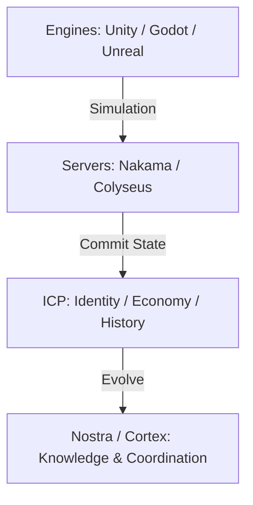

# Research Initiative 050: Nostra Metaverse & Books Standardation

**Status**: ⏸️ BLOCKED (Phase 1 Data Layer)
**Date**: 2026-01-25

> [!WARNING]
> **Status**: ⏸️ BLOCKED
>
> **Resolution**: This initiative defines **Data Layer** entities (Books/Metaverse).
> It is currently **BLOCKED** pending the "Constitution" Schema overhaul defined in [Research 066](../066-temporal-boundary/PLAN.md).
>
> **Action**: Do not implement further until `Entity` schema supports proper Subtyping.

---

## Executive Verdict

**Status**: ICP is metaverse-capable, but not metaverse-complete.

Nostra acts as the **Metaverse Authority Layer**, providing:
- ✅ Identity (Sovereign, Portable)
- ✅ Ownership & Economy (ICRC Standards)
- ✅ Governance & Evolution (Nostra Graphs/Processes)
- ✅ Persistence & History (The "Memory" of the Metaverse)

Nostra does **NOT** attempt to be:
- ❌ Real-Time Simulation Engine (Unity/Unreal/Godot do this)
- ❌ High-Frequency Physics Host (Nakama/Colyseus do this)

## The 5-Layer Metaverse Model

A complete metaverse stack requires:

| Layer | Status on ICP | Nostra Role |
| :--- | :--- | :--- |
| **1. Identity** | ✅ **World-Class** (Internet Identity) | Aggregation & Reputation (Delegation) |
| **2. Ownership** | ✅ **Strong** (Canisters/ICRC) | Asset Registry & Royalty Logic |
| **3. Persistence** | ✅ **Strong** (Stable Memory) | "Metaverse Memory" & Evolution History |
| **4. Simulation** | ⚠️ **Partial** (Slow) | **DELEGATE** to External Engines (Godot, etc.) |
| **5. Spatial** | ❌ **External** | **DELEGATE** to Client (glTF/USD) |

## Core Strategy: The Authority Layer

The architecture is strictly stratified:

### 1. Identity (The Passport)
- **Mechanism**: Internet Identity with Session Keys.
- **Bridge**:
    - **Web2**: OAuth (Google/Apple) -> II Link.
    - **Gaming**: Steam ID -> II Link.
    - **Crypto**: EVM/Solana Wallets -> II Link.
- **Benefit**: "Session Keys" allow signing transactions in the background without popups, essential for gaming flow.

### 2. Ownership & Provenance (The Vault)
- **Deterministic Canisters**: The ultimate source of truth for items, land, and rules.
- **Registry**: Hash-based asset registry to ensure client assets match server rules.

### 3. Persistence & History (The Memory)
- **Nostra's Key Differentiator**: "History is Sacred".
- **Function**:
    - Track world forks.
    - Attribute creators over time.
    - Evolve world rules via DAO proposals.
    - Preserve world lineage (who derived what from whom).

### 4. Simulation (The Engine)
- **Acceptance**: We admit ICP cannot run 60fps physics.
- **Integration**:
    - **Engine**: Godot (Primary), Unity/Unreal (Secondary).
    - **Server**: Nakama (Go) or Custom Rust.
    - **Flow**: Server runs the game -> Batches results -> Commits "Summary" to ICP every N minutes or at match end.

## Integration Plan

### 1. Engine Integrations
- **Godot**: Primary standard. Open source, WASM-friendly.
- **Unity**: Important for industry adoption.
- **Unreal**: Optional/High-end.

### 2. Server Integrations
- **Nakama**: Best-in-class open backend. Integration via S2S (Server-to-Server) calls to ICP Canisters.
- **Custom Rust**: For bespoke logic, running on high-performance cloud (AWS/Edge), committing to ICP.

### 3. Asset Standards
- **glTF**: The "JPEG of 3D". Primary format for assets.
- **USD**: Future standard, watch closely.

## Strategic Position

Nostra does not compete with Unity or Roblox.
**Nostra is the layer that makes Unity and Roblox projects sovereign, persistent, and governable.**

We are the **Evolution Engine**:
- We handle the "Meta" (Rules, Rights, Relationships).
- They handle the "Verse" (Physics, Rendering, Networking).
