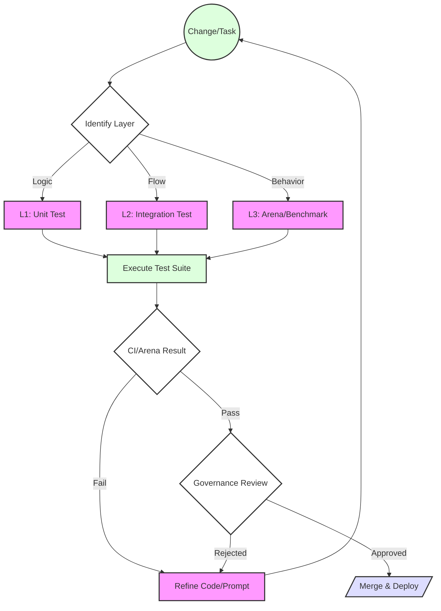

# 063 Standard Testing Methodology

## Objective
> **Status**: IMPLEMENTED
> **Owner**: User (Nostra Architect)
> **Priority**: Critical (P0)
> **Linked Initiatives**:
> - [059 - Benchmarking System](../059-benchmarking-system/RESEARCH.md) (Performance & Logic)
> - [055 - Compliance Validation](../055-compliance-validation/RESEARCH.md) (Policy & Regulation)
> - [047 - Temporal Architecture](../047-temporal-architecture/RESEARCH.md) (Workflow Reliability & Time-Slicing)
> - [060 - MemEvolve Integration](../060-memevolve-integration/RESEARCH.md) (Evolution Testing & Defect Profiles)
> - [057 - Development Brain](../057-development-brain/RESEARCH.md) (Visibility & Debugging)


## Problem Statement
Nostra is a polyglot, distributed system involving:
1.  **Canisters (Motoko)**: Actor-based, asynchronous state machines.
2.  **Workers (Rust)**: Temporal workflows, vector operations.
3.  **Frontend (Rust/JS)**: Dioxus (Nostra), React/A2UI (Cortex Web). *(Lit and Dioxus for Cortex Desktop are deprecated via DEC-074-001 and DEC-123-004)*.
4.  **Agents**: Non-deterministic logic generators.

Currently, testing is fragmented. There is no "Golden Path" for an agent to answer: *"How do I verify this change?"* This leads to:
-   **Fear of Change**: Without reliable tests, refactoring is risky.
-   **Drift**: Agents drift from their prompt instructions over time.
-   **Integration Hell**: Components work in isolation but fail when connected.

## Solution: The "Tesseract" Testing Model
We propose a 4-dimensional testing model (The Tesseract) that goes beyond the traditional "Pyramid".

### Dimension 1: The Stack (Vertical)
Standard testing levels, adapted for ICP/Nostra.

| Level | Scope | Tooling | Target |
|-------|-------|---------|--------|
| **L1: Unit** | Single Function/Module | `cargo test`, `moc --test` | Logic correctness, Edge cases |
| **L2: Integration** | Component Interactions | **PocketIC** (Canister-to-Canister), Temporal Mocks | Inter-canister calls, State updates |
| **L3: Simulation** | Protocol Flows | **Labs Runner**, `wasmtime` | Agent Logic, Game State, Workflows |
| **L4: E2E** | Full System | **Playwright**, `dfx test` | Frontend -> Backend -> Worker |

### Dimension 2: Time (Temporal)
Nostra treats Time as a primitive. Testing must reflect this.
-   **Determinism**: Workflows must be replayable.
-   **Temporal Invariants**: Any workflow test must assert that a *replay* of history produces identical observable state (commands/side-effects). This is the "Golden Rule" of Temporal.
-   **Time-Travel**: Tests must be able to "fast-forward" to test scheduled tasks (e.g., "Check status in 30 days").
-   **Recovery**: Tests must simulate worker crashes and verify state recovery (Temporal's core promise).

### Dimension 3: Agency (Behavioral)
Agents are probabilistic. We cannot just assert `result == "foo"`.
-   **Semantic Assertions**: Use embeddings to check if `result` is *semantically close* to "foo".
-   **Golden Sets**: Maintain reference inputs/outputs (from Initiative `059`).
-   **Drift Budget**: Establish an acceptable semantic distance range. Track this over time to detect slow, invisible degradation of agent personality or logic.
-   **Constitutional Checks**: Use `055` validations to ensure agents don't violate safety policies during execution.

### Dimension 4: Governance (Human-in-the-Loop)
-   **Plan Review**: Humans review the *Strategy* (Implementation Plan), not just the code.
-   **Visual Verification**: Use `057-development-brain` to visualize workflow traces and knowledge graph shapes.
-   **Artifacts as Contributions**: Test Plans, Benchmarks, and Arena Results are *first-class Contributions* with lineage in the Knowledge Graph. This closes the loop between testing and knowledge.

## Visibility & UI/UX Guidance
Testing is invisible work unless surfaced. We leverage **DevBrain (`057`)** as the lens.

### 1. The Quality Dashboard (The "traffic light")
A unified widget in `057` that aggregates signals from all 4 dimensions.
-   **L1/L2 (Code)**: Standard CI Pass/Fail badges.
-   **L3 (Arena)**: A "Win Rate" sparkline (e.g., "95% success over last 10 runs").
-   **L4 (Governance)**: A "Policy Compliance" shield icon (Green = Verified, Red = Violation).

### 2. Agent Replay Theater (The "Black Box")
For L3/L4 tests, the user needs to *see* what the agent did.
-   **A2UI Replay**: Since agents emit A2UI, we can record the JSON stream and replay it like a video.
-   **Drift Diff**: Visual comparison of the "Expected" vs "Actual" knowledge graph shape.

### 3. Agent Feedback Loop
How Agents "see" their own tests:
-   **Structured Logs**: When a test fails, the agent receives a crisp JSON error: `{"type": "TemporalFailure", "replay_mismatch_at": "Event 5"}`.
-   **Visual Context**: The Runner should generate a snapshot (PNG) of the UI state at failure time for multimodal agents to inspect.

## The "Golden Path" DAG Visual Flow
How an Agent should approach testing a change:



## Failure Taxonomy
To help Agents (and humans) identify the *type* of failure quickly:

| Failure Type | Symptom | Implication | Fix |
|--------------|---------|-------------|-----|
| **Logic Failure** | `assert_eq!` fails, panic, wrong return value | Code logic is incorrect | Fix the function/math (L1) |
| **Temporal Failure** | `NonDeteminsticError`, Replay mismatch | Workflow history doesn't match code path | Fix workflow versioning or remove side-effects (L2) |
| **Integration Failure** | `Canister reject`, Serialization error | Communication between components is broken | Fix Type/Interface definition (L2/L4) |
| **Behavioral Failure** | Drift budget exceeded, semantic mismatch | Agent is confusing instructions or hallucinating | Refine Prompt or Context (L3) |
| **Governance Failure** | Policy Violation, Missing Plan | Change is unauthorized or unsafe | Review Design/Specs (L4) |

## Implementation Guidelines

### 1. Canister Testing (Motoko)
**Standard**: PocketIC (Python or Rust bindings).
-   **Why**: Enables fast, deterministic simulation of the ICP replica locally.
-   **Pattern**:
    ```rust
    // setup
    let pic = PocketIc::new();
    let canister = pic.install_canister(...);
    // act
    canister.call("create_space", args);
    // time travel
    pic.advance_time(Duration::from_secs(3600));
    // assert
    let result = canister.call("get_stats", ...);
    ```

### 2. Worker Testing (Rust)
**Standard**: `cargo test` with Temporal Mocks.
-   **Why**: Temporal SDK provides extensive mocking capabilities to test Workflow logic without a running server.
-   **Pattern**:
    -   Unit test Activities (pure Rust functions).
    -   Integration test Workflows using `WorkflowEnvironment::start_time_skipping()`.

### 3. Agent Testing
**Standard**: The "Arena" (`059`).
-   Agents do not run in CI. They run in the **Arena**.
-   **CI Gate**: Code changes logic. The Arena verifies the *model's use* of that logic.

### 4. Frontend Testing
**Standard**: Playwright + A2UI Inspector.
-   **A2UI**: Verify the abstract JSON stream first, *then* the rendered pixels.
-   **Snapshots**: Visual regression testing for the Design System.

## Roles & Responsibilities

| Role | Responsibility |
|------|----------------|
| **Developer (Human/Agent)** | Write L1/L2 tests. Define L3 scenarios. |
| **Reviewer (Human)** | Approve "Test Plans". Review L4 visual results. |
| **CI System** | Run L1/L2 on every commit. |
| **The Arena (`059`)** | Run L3 (Benchmarks) on logic changes. |
| **Staging** | Run L4 (E2E) nightly. |

## Critical Directives for Agents
When an Agent is asked to "Test this": 1. **Identify the Layer**: Is it logic (L1), flow (L2), or behavior (L3)?
2. **Deterministic First**: Always prefer a deterministic test (Mock) over a live test (E2E).
3. **Validation Code**: Write the test *before* the implementation (TDD) whenever possible to prove understanding.
4. **Use The Tools**: Don't invent a test runner. Use `cargo test`, PocketIC, or the Benchmarking System.

## Advanced Testing Patterns

### Evolution Testing (from `060-memevolve`)
Agent memory architectures are not static. We must test how well agents *learn* and *adapt*.
-   **Dual-Loop Verification**:
    -   **Inner Loop (Content)**: Does the agent accumulate correct knowledge?
    -   **Outer Loop (Architecture)**: Does the memory *structure* improve over benchmark cycles?
-   **Defect Profiles**: When an Arena test fails, don't just log "FAIL". Output a **Defect Profile** (e.g., `{"stage": "Retrieval", "error": "Noise in context window"}`). This enables the Outer Loop optimizer to target specific genes (Encode/Store/Retrieve/Manage).
-   **Genetic Mutation Logging**: Any change to an agent's Memory Genotype (e.g., switching from RAG to HyDE) is a first-class Contribution with lineage.

### Time-Sliced Testing (from `047-temporal`)
Heavy data operations (vectors, logs) must be tested for cycle budget compliance.
-   **Pattern**: Use `TimeSlicedIndex` in tests. Verify that a 10,000-vector batch completes without hitting `40B` instruction limits.
-   **Assertion**: `assert!(total_instructions < BUDGET)` after each Activity.

### Interceptor Testing (from `047`)
Temporal Interceptors are middleware. They must be tested in isolation.
-   **Pattern**: Create mock interceptor chains (`Auth -> RateLimit -> Handler`) and verify each stage independently.

## Coverage Targets
To claim 99% coverage, the following areas **must** have explicit tests:

| Area | Test Type | Owner | Status |
|------|-----------|-------|--------|
| Canister CRUD | L2 (PocketIC) | Backend Team | Required |
| Temporal Workflows | L2 (Mocks) | Worker Team | Required |
| Agent Prompt Logic | L3 (Arena) | Agent Team | Required |
| A2UI Rendering | L4 (Playwright) | Frontend Team | Required |
| Policy Enforcement | L3 (Compliance Lab) | Governance | Required |
| Memory Evolution | L3 (EvolveLab) | Research | Recommended |
| Time-Sliced Indexing | L2 (PocketIC) | Vector Team | Required |

## Constitutional Alignment

Testing within Nostra must respect the **Nine Constitutions**. Key mappings:

| Constitution | Testing Principle |
|--------------|-------------------|
| **Labs** | Tests in Labs mode (`labs:*`) are *experiments*. Failures are learning, not blocking. |
| **Knowledge Integrity** | Test results (pass/fail, traces) are **Memory**. They must be preserved with lineage, not discarded. |
| **Stewardship & Roles** | Only **Stewards** can approve changes to core test suites. Agents propose; humans approve. |
| **Contribution Lifecycle** | Test Plans, Benchmarks, and Arena Results are **Contributions**. They can be forked, versioned, and archived. |
| **Agent Charter** | Agents default to `Recommend` mode for testing. `Execute` mode requires explicit grant. |
| **Security & Privacy** | Test data containing PII must be synthetic. No production data in test suites without explicit consent. |
| **Governance & Escalation** | Test failures on critical paths escalate to Steward review before merge is blocked. |
| **UI/UX Manifesto** | Test visibility is a first-class requirement. The Quality Dashboard is not optional. |

## Bloat Reduction & Deduplication Notes

- **Removed**: Redundant descriptions of Temporal time-travel (now linked to `047`).
- **Consolidated**: "Agent Testing" guidance now points to `059` Arena, avoiding duplication.
- **Clarified**: "Defect Profile" definition now in one place (Advanced Patterns), not repeated.
