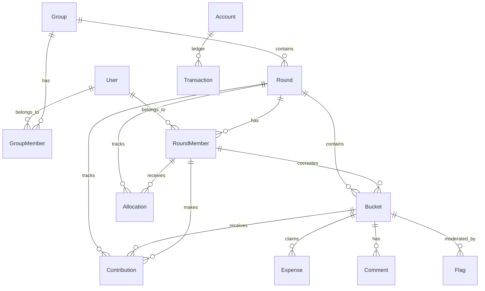
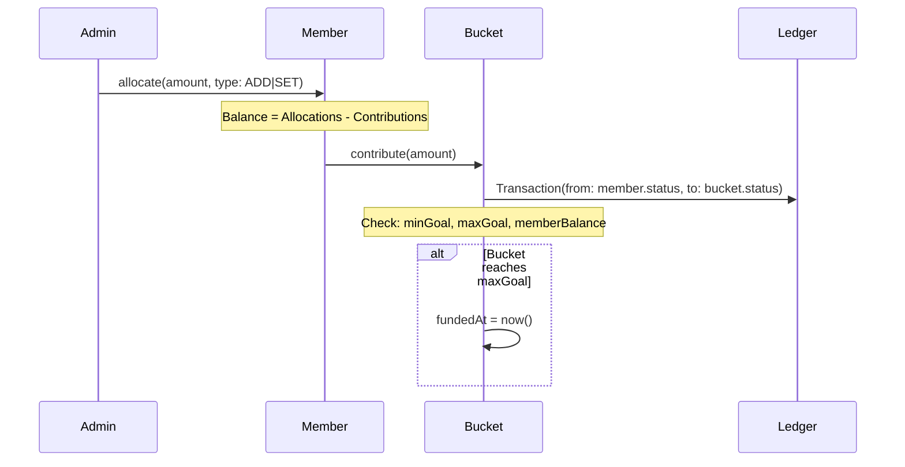
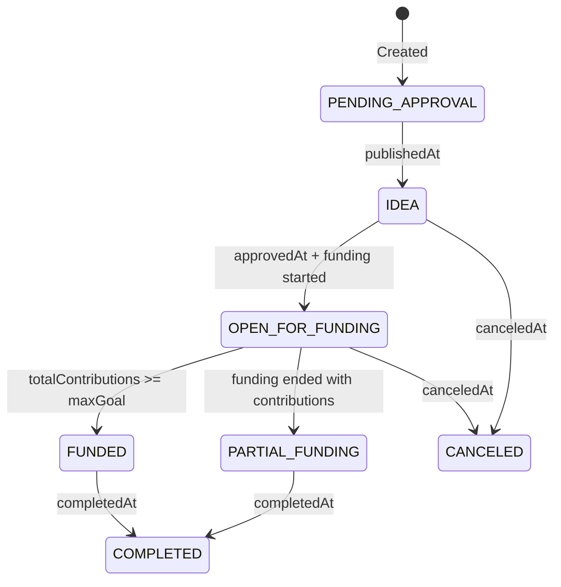

# Research Initiative 086: Cobudget Integration Patterns

> **Status**: 📋 Analysis Complete | **Type**: Reference Architecture | **Priority**: 🟠 HIGH

## Executive Summary

Cobudget is a production-grade **collaborative budgeting platform** built with Next.js, GraphQL, Prisma, and PostgreSQL. This research catalogs architectural patterns from Cobudget that can fill gaps in Nostra's capabilities, particularly in:

- **Governance & Voting** (proposal lifecycle, funding allocation)
- **Financial Primitives** (double-entry accounting, escrow, treasury)
- **Membership & Roles** (group/round/bucket hierarchy)
- **Event-Driven Architecture** (pub/sub, notifications)
- **Status Workflows** (state machine patterns)

---

## 1. Technology Stack Comparison

| Component | Cobudget | Nostra Equivalent | Gap Opportunity |
|:----------|:---------|:------------------|:----------------|
| Frontend | Next.js 14 + React 18 | Dioxus (Rust) | Component patterns |
| API | GraphQL (Apollo/URQL) | Candid (ICP) | Query patterns |
| Database | PostgreSQL + Prisma | Stable Storage (ICP) | Schema patterns |
| Auth | Passport.js (Magic Link) | Internet Identity | Flow patterns |
| Payments | Stripe | ICP Ledger + ckBTC | Integration model |
| Events | Custom EventHub | Actor messaging | Pub/sub patterns |
| i18n | react-intl + Crowdin | - | i18n architecture |

---

## 2. Core Domain Model (27 Prisma Models)

### 2.1 Entity Hierarchy



### 2.2 Key Entities → Nostra Mapping

| Cobudget Entity | Purpose | Nostra Primitive | Research Initiative |
|:----------------|:--------|:-----------------|:--------------------|
| **Group** | Organization container | Space | 007 Spaces Concept |
| **Round** | Funding cycle with rules | Governance Epoch | 012 Bootstrap Protocol |
| **Bucket** | Proposal seeking funding | Contribution/Proposal | 008 Contribution Types |
| **Allocation** | Budget given to member | Token Distribution | 003 Library Economics |
| **Contribution** | Funding to bucket | Stake/Vote | 006 Sentiment Capture |
| **Account** | Double-entry ledger | Ledger Primitive | NEW: Treasury Layer |
| **Transaction** | Money movement record | Transaction Log | 019 Log Registry |
| **Expense** | Expense claim | Claim Entity | 079 Merchant of Record |
| **Flag** | Moderation action | ContentFlag | 055 Compliance Validation |

---

## 3. Architectural Patterns for Nostra

### 3.1 Double-Entry Accounting Pattern ⭐

**Source**: `server/controller/index.ts`, `prisma/schema.prisma`

Cobudget implements true double-entry accounting with separate accounts:

```typescript
// Each RoundMember has 3 accounts:
model RoundMember {
  incomingAccount   Account? // Where allocations land
  statusAccount     Account? // Current balance
  outgoingAccount   Account? // Spent funds tracking
}

// Every financial action creates a Transaction
model Transaction {
  fromAccount   Account
  toAccount     Account
  amount        Int
}
```

**Nostra Application**:
- **Treasury Management**: Spaces need multi-account ledgers for grants, bounties, operating funds
- **Escrow Primitives**: Bucket funding model maps to bounty/grant escrow patterns
- **Audit Trail**: Transaction log enables complete financial history

**Integration Target**: Research 003 (Library Economics) + NEW research for Treasury Layer

---

### 3.2 Allocation/Contribution Flow ⭐

**Source**: `server/controller/index.ts` lines 16-169, 215-380

The allocation → contribution flow is a complete funding lifecycle:



**Key Validations** (from `contribute()`):
1. ✅ Granting window is open
2. ✅ Bucket is approved (not canceled, not already funded)
3. ✅ Contribution doesn't exceed bucket maxGoal
4. ✅ User hasn't exceeded per-bucket cap
5. ✅ User has sufficient balance (allocations - contributions)

**Nostra Application**:
- **Bounty Funding**: Multiple funders contribute to a bounty pool
- **Grant Programs**: Allocate tokens to community, let them vote with contributions
- **Quadratic Funding**: With minor modifications, the pattern supports QF

---

### 3.3 Status State Machine ⭐

**Source**: `server/graphql/resolvers/types/Bucket.ts` lines 174-206

Bucket status is computed from timestamps, not stored directly:

```typescript
export const status = async (bucket) => {
  if (bucket.completedAt) return "COMPLETED";
  if (bucket.canceledAt) return "CANCELED";
  if (bucket.fundedAt) return "FUNDED";
  if (bucket.approvedAt) {
    const { hasEnded, hasStarted } = await getRoundFundingStatuses({roundId});
    if (hasEnded) {
      const total = await bucketTotalContributions(bucket);
      return total > 0 ? "PARTIAL_FUNDING" : "IDEA";
    }
    if (hasStarted) return "OPEN_FOR_FUNDING";
    return "IDEA";
  }
  if (bucket.publishedAt) return "IDEA";
  return "PENDING_APPROVAL";
};
```

**State Diagram**:


**Nostra Application**:
- **Workflow Engine States**: Maps to Serverless Workflow state machine
- **Contribution Lifecycle**: Draft → Published → Approved → Funded → Completed
- **Time-Bound Governance**: Funding windows match governance epoch patterns

---

### 3.4 Role-Based Authorization Pattern

**Source**: `server/graphql/resolvers/auth.ts`

Hierarchical role model with resolver composition:

```typescript
// Role hierarchy
isGroupAdmin       → Full group control
isCollOrGroupAdmin → Round admin OR group admin
isCollMember       → Approved round participant
isBucketCocreatorOrCollAdminOrMod → Bucket owner OR admin OR moderator

// Composable auth with graphql-resolvers
export const editRound = combineResolvers(
  isCollOrGroupAdmin,  // Auth check first
  async (parent, { roundId, ...fields }) => { /* mutation */ }
);
```

**Nostra Application**:
- **Space Roles**: Owner, Admin, Moderator, Member, Guest
- **Contribution Roles**: Creator, Cocreator, Reviewer, Funder
- **Constitutional Enforcement**: Role checks before mutations

---

### 3.5 Event-Driven Pub/Sub Pattern

**Source**: `server/services/eventHub.service.js`, `server/subscribers/`

Simple but effective in-process pub/sub:

```javascript
class EventHub {
  static subscriptions = {};

  static publish = async (channel, event) => {
    const results = await Promise.all(
      this.subscriptions[channel].map(fn => fn(event))
    );
    return results.reduce((hash, result) => ({...result, ...hash}), {});
  };

  static subscribe(channel, namespace, fn) {
    this.subscriptions[channel] = this.subscriptions[channel].concat(fn);
  }
}
```

**Events Published**:
- `allocate-to-member` → Email notification
- `bulk-allocate` → Batch email notification
- `contribute-to-bucket` → Creator notification
- `publish-bucket` → Round members notification
- `cancel-funding` → Contributor refund notification
- `create-comment` → Mention notifications

**Nostra Application**:
- **Actor Messaging**: Maps to Nostra's actor model
- **Notification System**: Space activity streams
- **Workflow Triggers**: Event → Workflow → Action pattern

---

### 3.6 Funding Window Pattern

**Source**: `server/graphql/resolvers/helpers/index.ts` lines 266-275, 600-617

Time-boxed funding with computed state:

```typescript
export function isGrantingOpen(round) {
  const now = dayjs();
  const grantingHasOpened = round.grantingOpens
    ? dayjs(round.grantingOpens).isBefore(now)
    : true;  // Default: always open
  const grantingHasClosed = round.grantingCloses
    ? dayjs(round.grantingCloses).isBefore(now)
    : false; // Default: never closes
  return grantingHasOpened && !grantingHasClosed;
}
```

**Nostra Application**:
- **Governance Epochs**: Voting windows with start/end times
- **Bounty Deadlines**: Time-limited funding opportunities
- **Seasonal Grants**: Quarterly/annual funding cycles

---

### 3.7 Balance Calculation Pattern

**Source**: `server/graphql/resolvers/helpers/index.ts` lines 409-454

Balance is always computed, never stored (with caching hints):

```typescript
export async function roundMemberBalance(member) {
  const { _sum: { amount: totalAllocations } } = await prisma.allocation.aggregate({
    where: { roundMemberId: member.id },
    _sum: { amount: true },
  });

  const { _sum: { amount: totalContributions } } = await prisma.contribution.aggregate({
    where: { roundMemberId: member.id, deleted: { not: true } },
    _sum: { amount: true },
  });

  return totalAllocations - totalContributions;
}
```

**Nostra Application**:
- **Trustless Balance**: Never store derived state, always compute
- **ICP Optimization**: Aggregate queries map to stable storage scans
- **Snapshot Points**: Optional caching at epoch boundaries

---

### 3.8 Custom Fields Pattern

**Source**: `prisma/schema.prisma` lines 283-316

Dynamic schema extension per round:

```prisma
model Field {
  id          String    @id
  name        String
  description String
  type        FieldType // TEXT, MULTILINE_TEXT, BOOLEAN, ENUM, FILE
  limit       Int?
  isRequired  Boolean
  position    Float     // Ordering
  round       Round
  fieldValue  FieldValue[]
}

model FieldValue {
  field    Field
  value    Json      // Flexible storage
  bucket   Bucket
}
```

**Nostra Application**:
- **Dynamic Contribution Types**: Space-specific field definitions
- **Grant Application Forms**: Custom required fields per program
- **Schema Extension**: Without canister upgrades

---

### 3.9 Expense/Claim Pattern

**Source**: `prisma/schema.prisma` lines 56-111

Post-funding expense claims with receipts:

```prisma
model Expense {
  bucket          Bucket
  title           String
  recipientName   String?
  recipientEmail  String?
  status          ExpenseStatus  // DRAFT → SUBMITTED → APPROVED → PAID
  receipts        ExpenseReceipt[]
  ocId            String?        // Open Collective integration
}

model ExpenseReceipt {
  description String
  date        DateTime
  amount      Int
  attachment  String?    // File URL
}
```

**Nostra Application**:
- **Bounty Completion Claims**: Submit proof of work
- **Grant Milestone Reporting**: Expense reports per milestone
- **Reimbursement Workflows**: Community expense claims

---

### 3.10 Flag/Moderation Pattern

**Source**: `prisma/schema.prisma` lines 430-451

Guideline-based moderation with resolution tracking:

```prisma
model Flag {
  guideline       Guideline?  // Which rule was violated
  comment         String?     // Explanation
  collMember      RoundMember // Who raised it
  type            FlagType    // RAISE_FLAG, RESOLVE_FLAG, ALL_GOOD_FLAG
  resolvingFlag   Flag?       // Links resolution to original
  bucket          Bucket
}
```

**Nostra Application**:
- **Content Moderation**: Community-driven flagging
- **Constitutional Violations**: Flag contributions that breach rules
- **Dispute Resolution**: Paired raise/resolve actions

---

## 4. Integration Roadmap

### 4.1 Immediate Opportunities (Phase 1)

| Pattern | Nostra Research | Integration Path |
|:--------|:----------------|:-----------------|
| Status State Machine | 013 Workflow Engine | Add computed status to Contribution schema |
| Funding Windows | 012 Bootstrap Protocol | Governance epoch with open/close times |
| Role-Based Auth | 034 Constitutional Framework | Space role hierarchy |

### 4.2 Medium-Term Opportunities (Phase 2)

| Pattern | Nostra Research | Integration Path |
|:--------|:----------------|:-----------------|
| Double-Entry Accounting | NEW | Treasury canister with Account/Transaction |
| Allocation/Contribution | 003 Library Economics | Token distribution + voting |
| Event Pub/Sub | 013 Workflow Engine | Actor message routing |

### 4.3 Long-Term Opportunities (Phase 3)

| Pattern | Nostra Research | Integration Path |
|:--------|:----------------|:-----------------|
| Expense/Claims | 079 Merchant of Record | Bounty completion workflow |
| Custom Fields | 026 Schema Manager | Dynamic schema extensions |
| Flag/Moderation | 055 Compliance Validation | Content moderation workflow |

---

## 5. Schema Adaptation Examples

### 5.1 Nostra Funding Round Schema

Adapting Cobudget's Round model to Nostra:

```rust
// Candid equivalent
type FundingRound = record {
  id: text;
  space_id: principal;          // Group equivalent
  title: text;
  currency: text;               // "ICP", "ckBTC", "ckUSDC"

  // Funding window
  funding_opens: opt nat64;     // Unix timestamp
  funding_closes: opt nat64;

  // Limits
  max_amount_per_contributor: opt nat;

  // Registration
  registration_policy: RegistrationPolicy;  // Open, RequestToJoin, InviteOnly
  visibility: Visibility;                    // Public, Hidden

  // Status
  archived: bool;
  deleted: bool;
};
```

### 5.2 Nostra Proposal Schema

Adapting Cobudget's Bucket model:

```rust
type Proposal = record {
  id: text;
  round_id: text;
  title: text;
  description: opt text;

  // Budget
  min_goal: nat;
  max_goal: opt nat;          // Stretch goal

  // Status timestamps (computed status from these)
  published_at: opt nat64;
  approved_at: opt nat64;
  funded_at: opt nat64;
  completed_at: opt nat64;
  canceled_at: opt nat64;

  // Relationships
  cocreators: vec principal;
  contributions: vec Contribution;
};
```

---

## 6. Files Analyzed

| Category | File | Key Patterns |
|:---------|:-----|:-------------|
| Schema | `server/prisma/schema.prisma` | 27 models, entity relationships |
| Controller | `server/controller/index.ts` | Allocation, contribution flows |
| Helpers | `server/graphql/resolvers/helpers/index.ts` | Balance, status, validation |
| Auth | `server/graphql/resolvers/auth.ts` | Role-based authorization |
| Types | `server/graphql/resolvers/types/*.ts` | GraphQL field resolvers |
| Mutations | `server/graphql/resolvers/mutations/*.ts` | Business logic |
| Events | `server/services/eventHub.service.js` | Pub/sub pattern |
| Subscribers | `server/subscribers/*.ts` | Event handlers |
| Components | `ui/components/Bucket/*.tsx` | UI patterns |

---

## 7. Recommendations

### 7.1 Create New Research Initiatives

1. **087-nostra-treasury-layer**: Double-entry accounting for Spaces
2. **088-nostra-funding-rounds**: Governance epoch with funding windows
3. **089-nostra-expense-claims**: Post-contribution completion workflow

### 7.2 Enrich Existing Initiatives

| Initiative | Cobudget Pattern to Add |
|:-----------|:------------------------|
| 003 Library Economics | Allocation/Contribution model |
| 006 Sentiment Capture | Contribution as weighted vote |
| 008 Contribution Types | Custom Fields pattern |
| 013 Workflow Engine | Status state machine |
| 055 Compliance Validation | Flag/Moderation pattern |
| 079 Merchant of Record | Expense/Claims pattern |

### 7.3 Reference Implementation

The Cobudget codebase at `/Users/xaoj/ICP/research/reference/topics/data-knowledge/cobudget/` serves as a working reference for:
- Production GraphQL patterns
- React component architecture
- Stripe payment integration
- Email notification system
- i18n localization

---

## 8. Related Research

| ID | Initiative | Relationship |
|:---|:-----------|:-------------|
| 003 | Library Economics | Token distribution ↔ Allocation |
| 006 | Sentiment Capture | Voting ↔ Contribution |
| 008 | Contribution Types | Schema ↔ Custom Fields |
| 012 | Bootstrap Protocol | Epochs ↔ Rounds |
| 013 | Workflow Engine | State Machine ↔ Status |
| 019 | Log Registry | Audit Trail ↔ Transaction |
| 055 | Compliance Validation | Moderation ↔ Flags |
| 079 | Merchant of Record | Payments ↔ Expenses |
