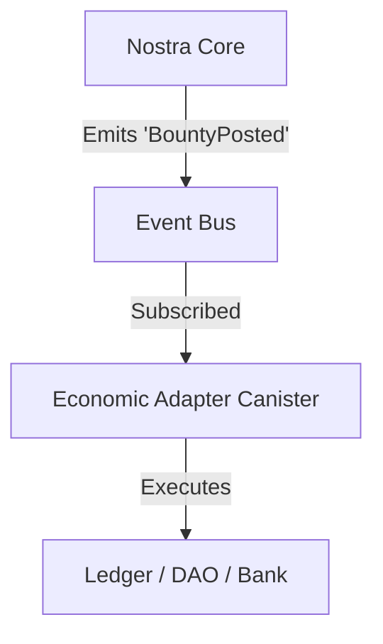

# Research Initiative 093: Economic Substrate

## 1. Executive Summary

This initiative explores the establishment of an "Economic Substrate" for Nostra—a foundational, inert layer that defines economic interfaces and primitives without enforcing specific execution logic or financial models. The goal is to prepare Nostra for future economic capabilities (bounties, pledges, services) without prematurely locking the architecture into specific monetary assumptions (tokens, fiat, reputation) or bloating the core kernel with business logic.

**Core Philosophy:** "Economic affordances, not economic logic."

## 2. Problem Statement

Nostra is currently in an epistemic phase, dealing with ideas, workflows, and simulations. Introducing a full "Economic Engine" (wallets, balances, payouts) now would:
- **Prematurely privilege specific contribution types** before governance norms emerge.
- **Bloat the core** with financial logic that may not apply to all Spaces.
- **Hard-code assumptions** about value (e.g., token-centric vs. reputation-centric) that violate Nostra's pluralistic principles.

However, completely ignoring economics risks building architectural dead-ends that make future monetization painful or impossible.

## 3. Proposed Solution: The Economic Substrate

The solution is to decouple **Economic Intent** (the "what") from **Economic Execution** (the "how").

### 3.1. Primitives: Economic Context via KIP

Instead of native ledger balances, we introduce an optional `EconomicContext` metadata layer that can be attached to any standard Nostra Contribution (Entity).

```typescript
// Conceptual Schema extension for KIP Entities
type EconomicContext = {
  value_type: "bounty" | "pledge" | "service" | "grant";
  unit: "ICP" | "USD" | "credits" | "reputation" | "cycles";
  amount: number;
  conditions?: string; // e.g., "Must pass CI", "Requires 2 approvers"
  escrow_hint?: string; // Reference to an external escrow mechanism
  payout_trigger?: string; // EntityID of the trigger (e.g., Milestone completion)
};
```

This context records *intent* but performs no enforcement.

### 3.2. Mechanism: Event-Sourced Intent

The substrate relies on emitting structured `EconomicEvents` rather than mutating a balance sheet.

- `BountyPosted`
- `PledgeCommitted`
- `DeliverableAccepted`
- `MilestoneCompleted`
- `ServiceFulfilled`

These events form an "Economic Graph" that can be indexed, visualized in Cortex, or acted upon by external agents.

### 3.3. Architecture: The Economic Adapter Pattern

Execution is externalized to "Economic Adapters"—specialized Canisters or Services that listen to the event stream and perform the actual value transfer.



This allows:
- **Space A** to use an ICP-based Adapter for crypto bounties.
- **Space B** to use a Reputation Adapter for gamified cooperation.
- **Space C** to run "Simulation Mode" where no real value moves, effectively "paper trading" economies.

## 4. Integration with Existing Systems

- **KIP (Knowledge Integrity Protocol)**: The `EconomicContext` becomes a standard schema extension within KIP.
- **Cortex**: The "Economic Graph" (e.g., this Bounty is linked to this Milestone) becomes a visual layer in the detailed view, allowing users to trace value flows without needing to see wallet balances.
- **A2UI**: Interfaces will be generated to define these intents (e.g., a "Post Bounty" form) that are distinct from wallet management interfaces.

## 5. Strategic Benefits

1.  **Architecture-First**: Prevents spaghetti code where financial logic is intertwined with application logic.
2.  **Pluralism**: Supports diverse economic models (gift economy, market economy, command economy) side-by-side.
3.  **Simulation**: Perfectly aligns with Nostra Labs' goal of simulating agent societies. We can test economic models without risking real capital.


## 6. Next Steps

1.  **Schema Definition**: Formalize the `EconomicContext` in the KIP schema registry. (Completed: `nostra/backend/modules/economics.mo`)
2.  **Event Design**: Define the standard payload for `EconomicEvents`. (Completed: `nostra/backend/modules/economics.mo`)

3.  **Adapter Interface**: Draft the Motoko interface for an `EconomicAdapter` actor. (Completed: `nostra/backend/types/EconomicAdapter.mo`)
4.  **Prototype**: Implement a "Paper Money" adapter in Nostra Labs to test the flow from `Intent` -> `Event` -> `Simulation`.

## 7. Implementation Status

**Status: ✅ COMPLETE**

| Module | Description | Path |
|--------|-------------|------|
| `economics.mo` | Context, Events, EconomicMode | `nostra/backend/modules/economics.mo` |
| `EconomicAdapter.mo` | Actor interface | `nostra/backend/types/EconomicAdapter.mo` |
| `adapter_registry.mo` | Per-Space routing | `nostra/backend/modules/adapter_registry.mo` |
| `ICPLedgerAdapter.mo` | Production adapter stub | `nostra/backend/types/ICPLedgerAdapter.mo` |
| `governance.mo` | EconomicAction proposals | `nostra/backend/modules/governance.mo` |
| `PaperMoneyAdapter.mo` | Lab prototype | `nostra/labs/economics/PaperMoneyAdapter.mo` |
| `kip.mo` | Event emission on UPSERT | `nostra/backend/modules/kip.mo` |

### Key Features
- **EconomicMode**: `#simulation | #live` toggle for paper trading vs real value
- **AdapterRegistry**: Per-Space adapter routing
- **Governance Integration**: `#economic_action` proposal type for escrow/payout approval
- **KIP Integration**: Automatic event emission on Bounty/Pledge/Service UPSERT
