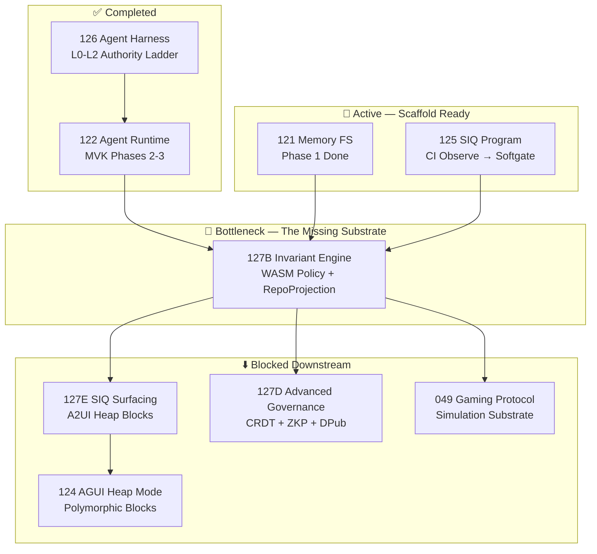
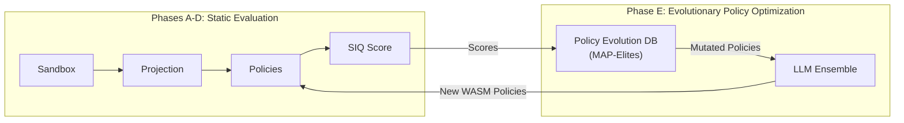

# Systems Engineering Roadmap: Integrating AlphaEvolve & OpenSage Findings

> Optimal path forward for absorbing research patterns into Cortex/Nostra, informed by full initiative dependency analysis.

---

## The Critical Path Argument

After auditing all active initiatives, the dependency graph reveals one bottleneck:



**127B (Cortex Invariant Engine)** is the singular highest-leverage insertion point because:
1. It is the **evaluation substrate** that 125 (SIQ) needs to move from "observe scripts" to "governed graph evaluation"
2. It is the **projection materializer** that 121 (Memory FS) sandboxes feed into
3. It blocks **three downstream documents** (127D, 127E, and 124 rendering)
4. It is where **both papers' patterns converge** — AlphaEvolve's evaluation cascade architecture + OpenSage's graph memory substrate

---

## The Single Next Move: Bootstrap the Repo Projection Engine

### What It Is

A Rust crate (`cortex-invariant-engine`) that:
1. **Ingests** a Memory FS sandbox directory
2. **Materializes** a multi-layer `RepoProjection` graph
3. **Evaluates** WASM governance policies against that graph
4. **Emits** structured `InvariantViolation` / `InvariantPassed` events to the Global Event Log

### Why This Specific Slice

| Alternative Considered | Why Not |
|---|---|
| Start with SIQ A2UI rendering (127E) | No violation data exists to render — need the engine first |
| Start with Memory FS Phase 2 (121) | Sandbox is ready but has nothing to feed its output *into* |
| Start with policy evolution (AlphaEvolve loop) | Premature — you need a working evaluator before you can evolve policies |
| Start with self-programming agents (OpenSage) | Too far downstream — agent topology features need governance guard integration that depends on 127B |

### How Both Papers Inform the Design

#### From AlphaEvolve: The Evaluation Cascade

The engine should implement **tiered evaluation** inspired by AlphaEvolve's hypothesis-testing cascade:

```
L0 — Structural Pass (Fast)
├── File exists? Required metadata present?
├── ~100ms per sandbox — prunes 80% of failures immediately
│
L1 — Graph Integrity Pass (Medium)
├── Cross-reference validity, dependency pinning, orphan detection
├── Requires materialized RepoProjection — ~1-5s
│
L2 — Semantic Validation Pass (Deep)
├── Symbol graph analysis, test coverage correlation
├── May invoke LLM-assisted evaluation (AlphaEvolve's "LLM feedback scores")
├── ~10-60s
```

This cascade is **not just optimization** — it's architecturally necessary:
- SIQ CI observe mode (125) needs L0 results in <1s to not block pipelines
- SIQ gateway read endpoints (125:Workstream E) serve pre-computed L0/L1 results
- L2 runs async (OpenSage's async tool execution pattern) with handle-based polling

#### From OpenSage: The Graph Projection as Structured Memory

The `RepoProjection` should be modeled as a **typed graph** (not flat JSON), directly applying OpenSage's Neo4j knowledge graph patterns:

```
Node Types: File, Directory, Symbol, Dependency, Test, Workflow, Initiative
Edge Types: CONTAINS, IMPORTS, DEPENDS_ON, TESTS, STEWARDS, REFERENCES
```

This graph becomes:
- The **evaluation target** for WASM policies (AlphaEvolve's automated evaluator)
- The **queryable memory** for the compliance memory agent (OpenSage's memory agent)
- The **backing data** for SIQ A2UI heap blocks (127E)

---

## Implementation Phases

### Phase A: RepoProjection Materializer (Week 1-2)

**Goal**: Given a sandbox directory, produce a typed `RepoProjection` graph in memory.

| Task | Initiative(s) Touched | Pattern Source |
|---|---|---|
| Define `RepoProjection` Rust structs (node/edge types, metadata) | 127B | OpenSage graph schema |
| Implement L0 file-graph walker (directories, artifacts, links) | 127B, 121 | — |
| Implement L0 metadata extractor (YAML frontmatter, stewardship) | 127B, 125 | — |
| Implement L1 symbol-graph extractor (Rust AST via `syn`, `tree-sitter`) | 127B | OpenSage entity extraction |
| Implement L1 dependency-graph extractor (`Cargo.toml`, `package.json`) | 127B | — |
| Wire sandbox ingestion path from Memory FS (121) | 121, 127 | OpenSage container sandbox |
| Cache projection snapshots with content-hash fingerprints | 121 | OpenSage Docker layer caching / AlphaEvolve program DB |

**Pre-Requisites**: 121 Memory FS sandbox directory structure (done), 122 MVK crate workspace (done).

### Phase B: WASM Policy Evaluator (Week 2-3)

**Goal**: Execute governance policies written in WASM against the materialized `RepoProjection`.

| Task | Initiative(s) Touched | Pattern Source |
|---|---|---|
| Define `GovernanceProfile` schema (list of policy WASM module refs) | 127B, 125 | AlphaEvolve task specification |
| Implement WASM runtime (Wasmtime) integration in Cortex | 127B | OPA-style policy evaluator |
| Define policy input/output ABI: `RepoProjection` → `PolicyResult[]` | 127B | AlphaEvolve evaluation function `h` |
| Implement evaluation cascade controller (L0→L1→L2 tiering) | 127B, 125 | AlphaEvolve hypothesis testing |
| Write 3-5 reference policies (stewardship metadata, dependency pinning, initiative directory) | 127B, 125 | Existing `check_research_portfolio_consistency.py` rules |
| Emit `GlobalEvent::InvariantViolation` / `InvariantPassed` | 127B, 122 | AlphaEvolve scored evaluation |
| Wire evaluation results into SIQ filesystem artifacts (`logs/siq/*`) | 125 | SIQ observe mode contract |

**Pre-Requisites**: Phase A projection materializer, 126 `GlobalEvent` envelope contract (done).

### Phase C: SIQ Gateway Integration (Week 3-4)

**Goal**: Expose invariant results through the existing SIQ read-only API surface (125:Workstream E).

| Task | Initiative(s) Touched | Pattern Source |
|---|---|---|
| Populate `logs/siq/*` from engine output | 125, 127B | — |
| Serve results via existing gateway endpoints (`/api/system/siq/gates/latest`) | 125, 123 | — |
| Implement graph-projection read endpoint (`/api/system/siq/graph-projection`) | 125, 127B | OpenSage graph retrieval tools |
| Add async execution handle for L2 deep evaluation | 127B, 122 | OpenSage async tool execution |
| Wire CI SIQ observe job to engine instead of shell scripts | 125 | — |

**Pre-Requisites**: Phase B evaluator, 125 gateway endpoints (scaffolded).

### Phase D: A2UI SIQ Surfacing (Week 4-5)

**Goal**: Render invariant results as interactive heap blocks in the Cortex UI.

| Task | Initiative(s) Touched | Pattern Source |
|---|---|---|
| Build `siq_formatter` Rust adapter (domain → A2UI JSONL) | 127E, 074 | — |
| Render SIQ Scorecard as A2UI Card with Heading/Tabs/List | 127E, 124 | OpenSage memory agent output |
| Implement "Re-evaluate" button dispatching `re-evaluate_projection` action | 127E, 122 | — |
| Implement "Generate Fix Proposal" spawning agentic remediation | 127E, 122 | OpenSage horizontal topology |
| Apply NDL motion semantics for error→success transitions | 127E, 074, 120 | — |

**Pre-Requisites**: Phase C gateway integration, 124 A2UI block rendering (done).

---

## Initiative Coverage Audit

Every active initiative touched by this roadmap, with its specific role:

| ID | Initiative | Role in Roadmap | Current State |
|---|---|---|---|
| **121** | Memory FS | Provides the sandbox directory structure for ingestion | Phase 1 done, Phase 2 is this roadmap |
| **122** | Agent Runtime Kernel | Provides MVK, `CortexTool` trait, `AuthorityGuard`, Temporal | Phases 2-3 done — engine executes as Temporal Activity |
| **124** | AGUI Heap Mode | Rendering target for SIQ blocks via polymorphic block contract | Active — block wrapper + CRDT done |
| **125** | SIQ Program | CI enforcement pipeline consuming engine output | Active — observe scaffolded, softgate pending engine |
| **126** | Agent Harness | Authority ladder (L0-L2) that gates all engine outputs | Completed — no blockers |
| **127** | Repo Ingestion | Parent initiative; engine is the Phase 2 core deliverable | Phase 1 done |
| **127B** | Invariant Engine | **The deliverable** — WASM policy execution over graph projections | Architecture drafted, no code |
| **127D** | Advanced Governance | CRDT/ZKP/DPub extensions to the engine | Blocked on 127B |
| **127E** | SIQ Surfacing | A2UI rendering of engine output | Blocked on 127B |
| **127F** | Polymorphic Enrichment | UX patterns for SIQ blocks | Blocked on 127E |
| **074** | UI Substrate | Theme tokens and motion semantics for SIQ rendering | Active — provides design system |
| **113** | CRDT Governance | CRDT vector clock snapshots for concurrent-edit invariants | Active — feeds 127D |
| **080** | DPub Standard | Edition pinning requires embedded SIQ execution records | Active — feeds 127D |
| **013** | Workflow Engine | Temporal workflows orchestrate engine evaluation runs | Active |
| **041** | Vector Store | Embedding-based retrieval for L2 semantic validation | Active |
| **049** | Gaming Protocol | Simulation substrate uses same evaluation cascade pattern | Draft — downstream consumer |
| **061** | ZK Integration | ZK proof wrapping for private SIQ attestation | Draft — future 127D extension |
| **090** | Agent Scaling Science | Evolutionary policy improvement uses engine as eval harness | Draft — future AlphaEvolve integration |

### Initiatives NOT Touched (Confirmed Out of Scope)

| ID | Why Not |
|---|---|
| 128 (GPUI Refactor) | Desktop shell; no dependency on evaluation engine |
| 096 (Offline Sync) | Transport layer; orthogonal to evaluation |
| 088 (Accessibility) | UI concern; no engine dependency |
| 118 (Runtime Extraction) | Phase closures complete; no new work |
| 119 (Nostra Commons) | Completed |

---

## Future Horizon: The Evolutionary Layer (Post-Phase D)

Once the evaluation cascade is running and producing scored results, the system becomes ready for the AlphaEvolve evolutionary loop:



This is explicitly **deferred** because:
1. You need a working evaluator (Phases A-B) before you can evolve anything
2. You need scored output data (Phase C) to train the evolutionary loop
3. The constitutional boundary (which policies are *allowed* to evolve) needs explicit ADR governance

Similarly, OpenSage's self-programming agent topology (agents creating sub-agents) is deferred until the evaluation cascade provides the sandboxed environment where self-created agents can be safely evaluated.

---

## Recommendation

**The single most powerful next step is Phase A: implement the `RepoProjection` materializer as a Rust crate within the Cortex workspace.** This is the keystone upon which everything else builds. It has zero external dependencies (only reads the filesystem), requires no new infrastructure (runs as a library call), and immediately unblocks Phases B-D and the four downstream initiatives waiting on it.
