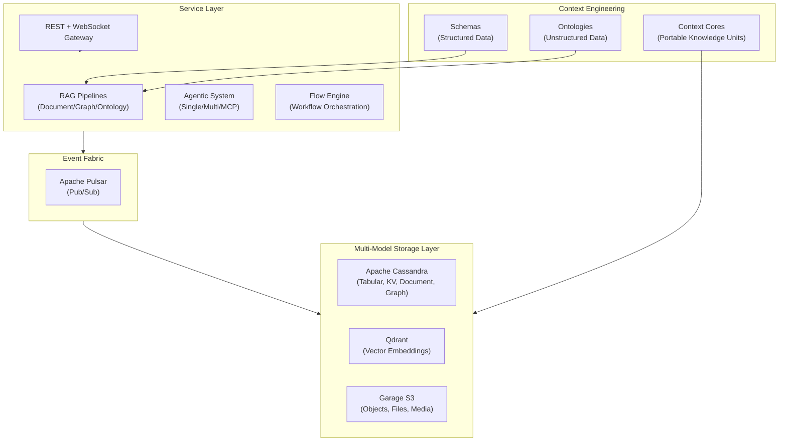
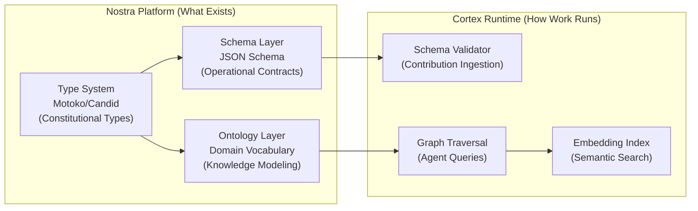

# TrustGraph Analysis

**Repository**: [trustgraph-ai/trustgraph](https://github.com/trustgraph-ai/trustgraph)
**Analyzed**: 2026-03-23
**License**: Apache 2.0
**Primary Language**: Python (services), TypeScript (UI libraries)
**Steward**: Research Steward

---

## 1. Executive Summary

TrustGraph is a **context development platform** — graph-native infrastructure for storing, enriching, and retrieving structured knowledge. It positions itself as "Supabase for context graphs," providing multi-model storage, semantic retrieval pipelines, portable **Context Cores**, and a developer toolkit. While its Python/Docker architecture is incompatible with ICP canisters, it offers significant **pattern-level** and **architectural-level** value for Nostra/Cortex graph capabilities. Treat it as a reference runtime for contracts and UX patterns, not as a transplantable implementation target.

> [!IMPORTANT]
> TrustGraph's strongest contribution to our ecosystem is the **Context Core** abstraction and its clear **schema vs ontology duality pattern** — exactly the gap identified in our current commons organization.

---

## 2. Architecture Overview

### Key Components

| Component | Technology | Purpose |
|-----------|-----------|---------|
| Multi-model DB | Cassandra | Tabular, KV, document, graph storage in one engine |
| Vector DB | Qdrant | Embedding storage and similarity search |
| Object Store | Garage (S3) | Files, images, video, audio |
| Message Bus | Apache Pulsar | High-speed pub/sub service fabric |
| RAG Pipelines | Custom Python | Document, Graph, and Ontology RAG variants |
| Agentic System | Custom | Single/Multi agent + MCP integration |
| Flow Engine | Custom | Runtime workflow orchestration with blueprints |
| Observability | Prometheus/Grafana/Loki | LLM latency, error rates, token throughput |

---

## 3. Extractable Patterns for Nostra/Cortex

### 3.1 Context Core Pattern (HIGH VALUE)

A **Context Core** is a portable, versioned bundle containing:
1. **Ontology** (domain schema) + mappings
2. **Context Graph** (entities, relationships, evidence)
3. **Embeddings / vector indexes** (semantic entry-point lookup)
4. **Source manifests + provenance** (where facts came from, when, how derived)
5. **Retrieval policies** (traversal rules, freshness, authority ranking)

**Relevance to Nostra**: This maps directly to our need for portable knowledge units within Spaces. A Nostra analog would be a **Knowledge Contribution** that bundles schema + graph data + embeddings + provenance metadata into a versioned, exportable artifact — essentially a "context-as-code" pattern. That analog is our inference, not an upstream TrustGraph term.

**Mapping**:
| TrustGraph | Nostra Analog | Status |
|------------|---------------|--------|
| Context Core | Space Knowledge Bundle | Not yet designed |
| Ontology | Contribution Type Schema | Partially exists (`contribution.types`) |
| Source Manifest | Lineage Record | Exists in `lineage_record` metadata |
| Retrieval Policy | Graph Traversal Rules | Not yet designed |
| Provenance | Event Source | Exists (`GlobalEvent.source`) |

### 3.2 Schema vs Ontology Duality (HIGH VALUE)

TrustGraph makes a critical architectural distinction:

| Concern | Schema | Ontology |
|---------|--------|----------|
| **Data type** | Structured data | Unstructured data |
| **Purpose** | Define custom schemas for structured knowledge bases | Define custom ontologies for unstructured knowledge bases |
| **RAG mode** | Rows Query (GraphQL) / Structured Query | GraphRAG / OntologyRAG |
| **Query interface** | GraphQL over typed rows | RDF triple pattern matching (S-P-O) |
| **Knowledge representation** | Typed fields, tables, relationships | Entities, predicates, typed/untyped literals |

**Key insight**: TrustGraph treats schemas and ontologies as **complementary data modeling tools**, not competing standards. Schemas handle structured data (tabular, relational), while ontologies handle knowledge graphs (entities, relationships, evidence chains).

### 3.3 Triple RAG Architecture (MEDIUM VALUE)

Three retrieval strategies, each optimized for different knowledge types:

1. **DocumentRAG** — Chunk-based retrieval from ingested documents (traditional RAG)
2. **GraphRAG** — Entity/relationship-aware retrieval from knowledge graphs
3. **OntologyRAG** — Ontology-constrained retrieval with precision guarantees

**Relevance**: Our graph-facing UX has primarily covered visualization so far, while retrieval and ingestion are being developed in adjacent initiatives. Adding retrieval semantics would enable Cortex agents to query the knowledge graph with structured patterns.

### 3.4 Flow Engine Pattern (MEDIUM VALUE)

TrustGraph's Flow system provides:
- **Blueprints** (stored definitions, like templates)
- **Instances** (running workflows)
- **Flow Classes** (preset configurations)
- **Runtime parameter adjustment** (LLM parameters tunable during execution)

**Relevance**: Maps to Cortex workflow concepts. The blueprint/instance separation mirrors our existing workflow authority model.

### 3.5 RDF Triple Query Interface (MEDIUM VALUE)

Pattern-based graph queries using S-P-O (Subject-Predicate-Object):
- Current gateway docs use `Term`/`Triple` wire formats with typed discriminators and named graph support, while older `{"v","e"}` examples are legacy compatibility snapshots.
- Flexible pattern matching (any combination of S/P/O filters)
- Named graph support for scoping queries
- 10K default / 100K max triple results

**Relevance**: Our `Contribution`/`Relation` model in `shared/specs.md` is structurally close to S-P-O triples. Adding a triple query interface would enable agents to traverse the knowledge graph programmatically, but the implementation should be expressed in Nostra-native contracts rather than copied wire formats.

### 3.6 Multiplexed WebSocket API (LOW-MEDIUM VALUE)

Single WebSocket connection multiplexing all services:
- Request/response correlation via IDs
- Streaming support for long-running operations
- Authentication per connection (not per request)

**Relevance**: Our `cortex-gateway` already implements WebSocket; the multiplexing pattern could enhance it.

---

## 4. Schema vs Ontology: Analysis for Nostra/Cortex Commons

### 4.1 Current State in Nostra

The Nostra ecosystem currently uses a **split approach**: constitutional types in `shared/specs.md` plus JSON Schema for operational contracts. What is missing is an explicit ontology layer and a registry-backed bundle format.

**Existing schemas** (`shared/standards/knowledge_graphs/`):
- `motoko_graph_snapshot.schema.json` — Graph state snapshots
- `motoko_graph_decision_event.schema.json` — Decision events
- `motoko_graph_monitoring_run.schema.json` — Monitoring run artifacts
- `motoko_graph_monitoring_trend.schema.json` — Trend analysis

**Other schemas** (`shared/standards/`):
- `siq_governance_gate.schema.json` — SIQ governance gates
- `siq_graph_projection.schema.json` — Graph projections
- `test_catalog.schema.json` / `test_run.schema.json` — Testing contracts
- `brand_policy.schema.json` — Branding policy

**Constitutional types** (`shared/specs.md`):
- `ActorID`, `UserProfile`, `Credential` (Motoko types)
- `GlobalEvent`, `EventSource`, `EventType` (Motoko types)
- `ResourceRef` (URI standard)
- `ActionTarget` (Candid records)

**Mappings** (`shared/mappings/`):
- `capability_lineage.v1.json` — Single mapping file

### 4.2 What's Missing

| Gap | Description | TrustGraph Has This |
|-----|-------------|---------------------|
| **Ontology layer** | No formal entity/relationship ontology | ✅ Full ontology editor |
| **Schema registry** | Schemas scattered across directories | ✅ Config service schema management |
| **Schema versioning** | No schema version management | ✅ Context Cores are versioned |
| **Retrieval policies** | No formalized graph traversal rules | ✅ Per-core retrieval policies |
| **Knowledge bundles** | No portable knowledge package format | ✅ Context Cores |
| **Triple interface** | No S-P-O query layer | ✅ Full triples query API |
| **Embedding integration** | No vector search tied to graph | ✅ Graph + Document + Row embeddings |

### 4.3 Proposed Schema vs Ontology Strategy for Nostra

**Recommended three-tier model**:

| Tier | Purpose | Format | Location | Exists? |
|------|---------|--------|----------|---------|
| **Constitutional Types** | Invariant data model | Motoko/Candid | `shared/specs.md`, `.did` files | ✅ Yes |
| **JSON Schemas** | Operational contracts for artifacts | JSON Schema | `shared/standards/` | ✅ Yes (scattered) |
| **Domain Ontology** | Knowledge modeling vocabulary | RDF/OWL-lite or custom JSON-LD | `shared/ontology/` (proposed) | ❌ No |

### 4.4 Recommended Next Steps

1. **Register schemas in place**: Add a schema registry index over the existing `shared/standards/` layout before moving files
2. **Create `shared/ontology/` directory**: Start with a minimal domain vocabulary for Spaces, Contributions, Capabilities, and provenance scopes
3. **Define Knowledge Bundle spec**: Inspired by Context Cores, but expressed as a Nostra manifest with ontology references, graph snapshot refs, embeddings manifests, provenance roots, and retrieval policy
4. **Add a read-only triple facade**: Enable agents to query `Contribution`/`Relation` data via S-P-O patterns and named graph scopes
5. **Prototype OntologyRAG later**: Use ontology definitions to constrain and guide retrieval only after ingestion quality and cross-indexing are stabilized

---

## 5. Scorecard

| Criterion | Score (0-5) | Rationale |
|-----------|------------|-----------|
| `ecosystem_fit` | 3 | Python/Docker architecture, not ICP-native. Pattern value is the extraction target. |
| `adapter_value` | 2 | No direct adapter possible; value is in pattern study. |
| `component_value` | 3 | Context Core concept and schema/ontology duality are liftable designs. |
| `pattern_value` | 5 | Context Cores, triple RAG, schema/ontology duality, flow blueprints — all highly relevant. |
| `ux_value` | 3 | Workbench UI patterns (3D graph viz, schema/ontology editors) are informative. |
| `future_optionality` | 4 | Positions us to build a knowledge substrate with proven architectural patterns. |
| `topic_fit` | 5 | Directly serves data-knowledge topic and graph capabilities research. |
| **Total** | **25/35** | Passes intake threshold (≥12). |

---

## 6. Known Risks

- **Python/Docker runtime**: Not directly usable in ICP/WASM context. All value extraction is pattern-based.
- **Scale mismatch**: TrustGraph is designed for cloud-scale service meshes, while Nostra's initial deployment is more compact and governance-driven.
- **Ontology complexity**: Full OWL/RDF tooling may be over-engineered for our current stage. Start minimal.
- **Wire-format drift**: The gateway wire format evolved from `Value` to `Term`; older examples in the analysis can go stale quickly.
- **Upstream drift**: Active project with rapid changes; snapshot reference only.

---

## 7. Suggested Experiments

1. Design a `KnowledgeBundle` type in `shared/specs.md` inspired by Context Cores (ontology + graph + embeddings + provenance).
2. Prototype a triple query interface on the existing `Contribution`/`Relation` model.
3. Evaluate a minimal ontology format (JSON-LD subset) for defining Space-local domain vocabularies.
4. Study TrustGraph's Schema and Ontology workbench editors for UX patterns applicable to the Capability Graph Editor.
5. Compare TrustGraph's Pulsar-based event fabric with our `GlobalEvent` system and Cortex gateway WebSocket.

---

## 8. Links to Nostra/Cortex

- **Knowledge substrate**: Context Cores → Space Knowledge Bundles
- **Schema/ontology duality**: Informs `shared/` commons reorganization
- **Graph query patterns**: Triple queries → Contribution/Relation traversal
- **Agent retrieval**: GraphRAG/OntologyRAG → Cortex agent knowledge access
- **Flow engine**: Blueprint/instance → Workflow authority model validation
- **3D visualization**: Graph visualizer → Existing D3/graph work (075, 020, 136)

---

## 9. Authority & Governance

| Field | Value |
|-------|-------|
| `primary_steward` | Research Steward |
| `authority_mode` | `recommendation_only` |
| `escalation_path` | `steward_review -> owner_decision` |
| `lineage_record` | `research/REFERENCE_MIGRATION_LINEAGE.md` |
| `initiative_refs` | `078-knowledge-graphs`, `082-graphiti-integration-analysis`, `130-space-capability-graph-governance` |
